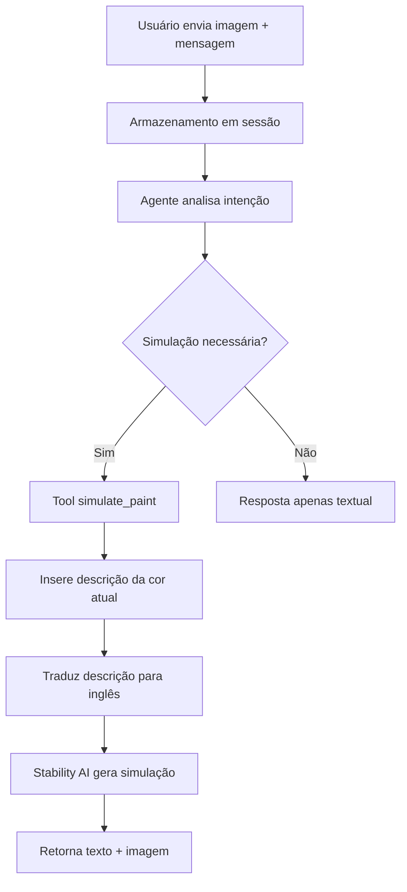

# Desafio Back IA - Catálogo Inteligente de Tintas Suvinil

## Descrição

O **pAInt** (Intelligent Paint Catalog Assistant) é um assistente inteligente para recomendação de tintas Suvinil que combina conceitos modernos de IA com uma arquitetura robusta de microsserviços. O sistema utiliza agentes colaborativos baseados em LangChain, pipeline RAG (Retrieval-Augmented Generation) e APIs da OpenAI para oferecer recomendações personalizadas através de conversas naturais em português. A solução implementa Clean Architecture, princípios SOLID e uma estratégia completa de testes automatizados.

## Arquitetura da Solução

A solução adota uma **arquitetura de microsserviços** com separação clara de responsabilidades:

### Serviços Principais

#### 🎨 **AI Service** (Porta 8001)
- **Responsabilidade**: Lógica de IA, agentes colaborativos e pipeline RAG
- **Tecnologias**: LangChain + OpenAI GPT + Embeddings + pgvector
- **Funcionalidades**:
  - Intent Router para classificação inteligente de consultas
  - Agentes especializados para recomendação de tintas
  - **🎨 Simulação visual de pintura com IA** (Stability AI)
  - Busca semântica com embeddings OpenAI
  - Gerenciamento de conversas com persistência de sessão
  - Pipeline RAG para recuperação aumentada de informações

#### 🏗️ **API Service** (Porta 8000)
- **Responsabilidade**: CRUD de tintas, gerenciamento de usuários e autenticação JWT
- **Tecnologias**: FastAPI + SQLAlchemy + PostgreSQL + JWT/RBAC
- **Funcionalidades**:
  - API RESTful para catálogo de tintas
  - Sistema de autenticação com Role-Based Access Control
  - Clean Architecture com padrões Repository e Use Cases
  - Documentação automática com Swagger/OpenAPI

#### 🗄️ **Database** (PostgreSQL + pgvector)
- **Responsabilidade**: Persistência de dados e busca vetorial
- **Tecnologias**: PostgreSQL 15 + extensão pgvector
- **Funcionalidades**:
  - Armazenamento do catálogo de tintas Suvinil
  - Embeddings vetoriais para busca semântica
  - Gerenciamento de usuários e sessões de conversa
  - Migrações versionadas e dados de seed

## Tech Stack

### **Linguagem**
- Python 3.11.10

### **Frameworks & Bibliotecas**
- **Backend**: FastAPI
- **IA & LLMs**: OpenAI (GPT-3.5-turbo), LangChain, Embeddings (text-embedding-ada-002)
- **Geração de Imagens**: Stability AI (Stable Diffusion XL) para simulação de pintura
- **Banco de Dados**: PostgreSQL 15 com pgvector para busca vetorial
- **ORM**: SQLAlchemy 2.0 (async)
- **Autenticação**: JWT com Role-Based Access Control (RBAC)
- **Testes**: pytest, pytest-asyncio, pytest-cov

### **Infraestrutura & DevOps**
- **Containerização**: Docker + Docker Compose
- **Documentação da API**: Swagger/OpenAPI + ReDoc
- **Desenvolvimento**: Hot-reload, Volume mounting
- **Análise Estática de Tipos**: Pyright
- **Monitoramento**: Health checks e logging estruturado

## Setup e Execução Local

### Pré-requisitos
- **Docker** e **Docker Compose** instalados
- **Chave da API OpenAI** (obrigatória para funcionalidade de IA)

### Instalação

1. **Clone o repositório:**
```bash
git clone https://github.com/mrcndz/pAInt.git
cd pAInt
```

2. **Configure as variáveis de ambiente:**
```bash
cp .env.example .env
```

3. **Edite o arquivo `.env` e configure as seguintes variáveis essenciais:**
```bash
# ⚠️ OBRIGATÓRIO: Suas chaves de API
OPENAI_API_KEY=sua-chave-openai-aqui
STABILITY_API_KEY=sua-chave-stability-ai-aqui

# Configurações do banco (podem manter os valores padrão)
POSTGRES_USER=paint_user
POSTGRES_PASSWORD=paint_password
POSTGRES_DB=paint_catalog

# JWT Secret (altere em produção)
JWT_SECRET=seu-jwt-secret-super-seguro
```

4. **Execute o projeto:**
```bash
docker-compose up -d
```

5. (Opcional) Caso queira desenvolver localmente
```bash
```

### Acesso aos Serviços

Após a execução, os serviços estarão disponíveis em:

- **🎨 AI Service (Swagger)**: http://localhost:8001/docs
- **🏗️ API Geral (Swagger)**: http://localhost:8000/docs
- **📚 API Geral (ReDoc)**: http://localhost:8000/redoc
- **🗄️ PostgreSQL**: localhost:5432

## Estrutura do Projeto

```
pAInt/
├── libs/                          # Biblioteca de microsserviços
│   ├── api/                      # Serviço de API CRUD
│   │   ├── app/
│   │   │   ├── auth/            # Autenticação e autorização
│   │   │   ├── core/            # Entidades, repositórios e casos de uso
│   │   │   ├── routes/          # Endpoints da API
│   │   │   └── main.py          # Aplicação FastAPI
│   │   └── Dockerfile
│   ├── ai_service/              # Serviço de IA
│   │   ├── app/
│   │   │   ├── agents/          # Agentes colaborativos
│   │   │   │   ├── intent_router.py              # Router de classificação de intenções
│   │   │   │   └── paint_recommendation_agent.py # Agente de recomendações
│   │   │   ├── api/             # Endpoints de IA
│   │   │   ├── auth/            # Dependências de autenticação
│   │   │   ├── config/          # Configurações
│   │   │   ├── rag/             # Pipeline RAG e vector store
│   │   │   ├── services/        # Gerenciador de conversas
│   │   │   └── main.py          # Aplicação FastAPI
│   │   ├── tests/               # Testes unitários do AI Service
│   │   └── Dockerfile
│   └── shared/                  # Código compartilhado
│       ├── database.py          # Conexões e modelos SQLAlchemy
│       └── models.py            # Modelos de dados
├── database/                    # Migrations e scripts de banco
│   ├── migrations/              # Scripts SQL versionados
│   ├── init_db.py              # Inicializador do banco
│   └── seed_data.py            # Dados de exemplo
├── tests/                       # Testes de integração
├── postman/                     # Coleção Postman para testes
├── docker-compose.yml           # Orquestração dos serviços
└── .env.example                # Exemplo de configuração
```

## Testes

### Executar Testes

```bash
# Depois de criar um ambiente virtual, instale as dependências
pip install -r requirements.txt

# Rodando os testes

# Testes de integração
./tests/run_tests.sh

# Testes do AI Service
cd libs/ai_service && ./run_tests.sh
```

### Testes com Postman

O projeto inclui uma **coleção Postman completa** localizada em `/postman/` requisições organizadas para testar:
- 🔐 **Fluxos de autenticação** completos
- 🎨 **Endpoints de IA** e recomendações
- 🗃️ **CRUD de tintas** com diferentes permissões
- 🔄 **Cenários multi-sessão** para testes de conversação
- 📊 **Health checks** e monitoramento

A coleção inclui configurações de ambiente pré-definidas e scripts de automação para gerenciamento de tokens JWT.

### Cobertura de Testes

O projeto possui **testes abrangentes** que cobrem:
- ✅ **Testes unitários** dos agentes de IA (60+ testes)
- ✅ **Testes de integração** da API
- ✅ **Testes de autenticação** e autorização
- ✅ **Testes do pipeline RAG** e vector store
- ✅ **Testes de persistência** de conversas
- ✅ **Mocks e fixtures** para isolamento de dependências

## Aplicação Prática de Conceitos de IA

### **LLMs e LangChain**
O sistema utiliza **LangChain** como framework orquestrador para conectar-se com o modelo **GPT-3.5-turbo** da OpenAI. A LangChain gerencia o fluxo de conversação, o histórico de mensagens e a execução de ferramentas (tools) pelos agentes. O pipeline implementa padrões avançados como:
- **Memory Management**: Conversas persistem entre sessões
- **Tool Usage**: Agentes utilizam ferramentas especializadas para busca e filtros
- **Error Handling**: Tratamento robusto de erros e timeouts
- **Template Management**: Prompts estruturados com placeholders dinâmicos

### **Agentes Colaborativos (AgentFlow)**
O sistema implementa uma arquitetura de **agentes especializados** com responsabilidades distintas:

#### 🚦 **Intent Router** (`intent_router.py`)
- **Especialidade**: Classificação inteligente de consultas antes do processamento principal
- **Tecnologia**: GPT-3.5-turbo com saída estruturada (Structured Output)
- **Funcionalidades**:
  - Classifica consultas em 3 categorias: `paint_question`, `simple_greeting`, `off_topic`
  - Otimização de custos: só aciona agentes complexos para perguntas relevantes
  - Respostas instantâneas para saudações e redirecionamentos educados
  - Precisão na classificação com alta confiança
- **Benefícios**: Reduz significativamente custos de API e melhora a experiência do usuário

#### 🎯 **Agent de Recomendação** (`paint_recommendation_agent.py`)
- **Especialidade**: Conversação natural e recomendações personalizadas
- **Ferramentas disponíveis**:
  - `search_paints`: Busca semântica por produtos
  - `filter_paints`: Filtros avançados por atributos
  - `get_paint_details`: Detalhes específicos de produtos
  - **`simulate_paint`**: Simulação visual de cores em imagens reais
- **Contexto**: Mantém histórico de conversa para recomendações contextualizadas
- **Capacidades**: Entende português, faz perguntas de esclarecimento, oferece alternativas

#### 🧠 **Agent de Enriquecimento** (`paint_product_enrichment_agent.py`)
- **Especialidade**: Processamento e enriquecimento de dados do catálogo
- **Funcionalidades**:
  - Geração de resumos inteligentes dos produtos
  - Criação de tags de uso contextual
  - Otimização de descrições para busca semântica

### **Embedding e RAG (Retrieval-Augmented Generation)**
O pipeline RAG implementa busca semântica avançada através do seguinte fluxo:

#### 📊 **Pipeline de Indexação**:
1. **Preparação**: Dados das tintas são processados e estruturados
2. **Embedding**: Conteúdo é convertido em vetores usando `text-embedding-ada-002`
3. **Armazenamento**: Embeddings são persistidos no PostgreSQL com pgvector
4. **Indexação**: Índices GIN otimizam consultas vetoriais

#### 🔍 **Pipeline de Recuperação**:
1. **Query Embedding**: Pergunta do usuário é convertida em vetor
2. **Similarity Search**: Busca por similaridade de cosseno no espaço vetorial
3. **Hybrid Filtering**: Combina busca semântica com filtros de metadados
4. **Ranking**: Resultados são ordenados por relevância e aplicabilidade
5. **Context Injection**: Produtos relevantes são injetados no prompt do agente

### **Prompt Engineering**
Prompts cuidadosamente elaborados instruem os agentes sobre personalidade, conhecimento e comportamento:

**Exemplo de Prompt do Agente de Recomendação:**
```python
system_prompt = """You are an intelligent paint recommendation assistant for Suvinil paints. 
You help customers find the perfect paint products based on their needs, preferences, and project requirements.

Key Responsibilities:
- Understand customer requirements through natural conversation
- Search and recommend appropriate paint products using available tools
- Provide detailed product information including prices, features, and usage recommendations
- Maintain conversation context to provide personalized recommendations
- When users provide images, use the simulate_paint tool to show them how recommended paints would look
- Only use paint simulation when both an image and a specific paint color/product are available
- Answer questions in Portuguese (primary) or English as appropriate

Guidelines:
- Always be helpful, professional, and enthusiastic about paint projects
- Ask clarifying questions when requirements are unclear
- Recommend specific products with prices when possible
- Consider factors like room type, lighting, usage patterns, and maintenance needs
- Explain the reasoning behind your recommendations
- Use the search and filter tools effectively to find the best matches
- Remember previous conversation context to provide continuous assistance
- The image data is stored separately and accessed via tools - never include actual image data in conversations

Available Product Information:
- Suvinil paint products with various colors, finishes, and features
- Price information in Brazilian Reais (BRL)
- Surface compatibility (walls, ceilings, wood, metal, etc.)
- Environmental suitability (internal/external use)
- Special features (washable, anti-mold, quick-dry, etc.)
- Product lines (Premium, Standard, Economy, Specialty)

Available Tools:
- search_paints: Semantic search for paint products
- filter_paints: Advanced filtering by attributes  
- get_paint_details: Detailed product information
- simulate_paint: Visual simulation of colors on user's uploaded images

Remember: You have access to search_paints, filter_paints, get_paint_details, and simulate_paint tools to help customers find exactly what they need and visualize the results.
"""
```

## 🎨 Simulação Visual de Pintura com IA

Uma das funcionalidades mais inovadoras do **pAInt** é a **simulação visual de pintura em tempo real** usando inteligência artificial. Esta feature permite que os usuários vejam exatamente como uma cor ficaria em seu ambiente antes de comprar a tinta.

### **Como Funciona**

#### 🖼️ **Upload de Imagem + Conversa Natural**
```bash
# Usuário envia uma foto do ambiente + mensagem
POST /api/v1/recommend
{
  "message": "Como ficaria essa parede em azul serenidade?",
  "image_base64": "iVBORw0KGgoAAAANSUhEUgAA...",
  "session_uuid": "opcional"
}
```

#### 🤖 **Processamento Inteligente**
1. **Recomendação**: Agente sugere produtos Suvinil que correspondem à solicitação
2. **Simulação**: Stability AI gera a visualização com a nova cor aplicada
3. **Resposta Completa**: Retorna tanto o texto conversacional quanto a imagem simulada

#### 📱 **Resposta Integrada**
```json
{
  "response": "Ótima escolha! O Azul Serenidade Suvinil Premium ficará perfeito no seu ambiente. Aqui está a simulação:",
  "session_uuid": "abc-123-def",
  "image_data": "base64-da-imagem-simulada..."
}
```

### **Tecnologias Utilizadas**

#### 🔧 **Pipeline de Processamento**
- **OpenAI GPT-4o**: Análise automática de cores e contexto da imagem
- **Stability AI (SDXL)**: Geração de alta qualidade da simulação de pintura
- **OpenCV**: Processamento de imagem e mascaramento inteligente
- **Tradução Automática**: Converte descrições em português para inglês (requisito da Stability AI)

#### 💡 **Otimizações Inteligentes**
- **Zero Tokens para Imagens**: Imagens não são enviadas para o contexto do LLM, economizando custos
- **Execução Assíncrona**: Processamento em threads separadas para não bloquear a API
- **Cache de Sessão**: Imagens ficam disponíveis durante toda a conversa

### **Integração Seamless com Conversação**

A simulação não é um endpoint separado - está **completamente integrada** no agente conversacional:

```
👤 Usuário: [ENVIA FOTO] "Quero mudar a cor da parede, que cor você recomenda?"

🤖 AI: "Vejo que sua parede atual é bege. Para um ambiente mais moderno, recomendo 
       o Azul Serenidade ou Cinza Concreto. Qual prefere?"

👤 Usuário: "Azul serenidade, como ficaria?"

🤖 AI: [SIMULA AUTOMATICAMENTE] "Perfeito! Aqui está como ficaria com o Suvinil 
       Azul Serenidade Premium. A cor traz elegância e tranquilidade ao ambiente."
       [RETORNA IMAGEM SIMULADA]
```

### **Casos de Uso**

#### 🏠 **Ambientes Residenciais**
- Salas de estar, quartos, cozinhas
- Fachadas e áreas externas
- Escritórios domésticos

#### 🎨 **Tipos de Simulação**
- Mudança completa de cor
- Comparação entre diferentes tons
- Visualização de acabamentos (fosco, acetinado, etc.)
- Combinações de cores para ambientes integrados

### **Fluxo Técnico Detalhado**



### **Exemplo de Implementação**

O agente automaticamente decide quando usar a simulação baseado no contexto:

```python
# Detecta quando o usuário quer visualização
if user_uploaded_image and mentions_specific_color:
    result = agent.use_tool("simulate_paint", {
        "paint_description": "Suvinil Azul Serenidade Premium"
    })
    return {
        "response": conversational_response,
        "image_data": simulated_image_base64
    }
```

Esta funcionalidade representa um avanço significativo na experiência do usuário, permitindo decisões de compra mais informadas e confiantes através da **visualização realística** das cores em seus próprios ambientes.

## Uso de Ferramentas de IA no Desenvolvimento

### **Ferramentas Utilizadas**
Para acelerar o desenvolvimento e seguir as boas práticas sugeridas, foram utilizadas as seguintes ferramentas de IA: **Claude** para geração de código, **Manus** para pesquisa, **Supermaven** e **Github Copilot** para autocomplete e **Gemini** para revisão e sessões de brainstorm.

### **Exemplos de Prompts Usados**

Os exemplos detalhados de prompts utilizados durante o desenvolvimento estão documentados no arquivo **[prompt_examples.md](./prompt_examples.md)**, incluindo prompts para arquitetura, implementação RAG, testes e otimizações.

### **Tomada de Decisão com Base nas Sugestões**
Todo código gerado por IA foi cuidadosamente **revisado, testado e adaptado** ao contexto específico da arquitetura do projeto. As ferramentas de IA serviram como um "copiloto inteligente" para:
- **Acelerar a prototipagem** de funcionalidades complexas
- **Sugerir padrões de código** e boas práticas
- **Auxiliar na resolução de problemas** técnicos específicos
- **Otimizar consultas** de banco de dados e algoritmos

Entretanto, todas as decisões arquiteturais, escolhas de tecnologia e implementações críticas foram **validadas através de análise técnica rigorosa**, garantindo que o código final atenda aos requisitos de qualidade, segurança e performance.

## Metodologia de Desenvolvimento

**Versionamento de Código**: O desenvolvimento utilizou branches de feature para novas implementações, pull requests para revisão de código e mantendo a branch `main` sempre estável. Esta abordagem garantiu um desenvolvimento organizado e rastreável, com histórico claro de mudanças e facilidade para rollbacks quando necessário.

## Gestão de Projeto

Para o gerenciamento das atividades do projeto, foi utilizada a ferramenta **Notion** com metodologia ágil e board Kanban.

**Links do Projeto**: 
- **📋 Kanban Board**: https://www.notion.so/21568cc7fc05808cb0a8ebec293e76f7?v=21568cc7fc0580b89382000cefeaedf6
- **🔧 Decisões Técnicas**: https://www.notion.so/21568cc7fc05806d8ec6ce7bb1c97f29?v=21568cc7fc0580fea225000c4b54efd7&source=copy_link

## Catálogo de Tintas Suvinil

### **Linhas de Produtos**
- **Premium** (R$ 89-129): Tintas de alta qualidade com recursos avançados
- **Standard** (R$ 59-66): Opções intermediárias com boa cobertura
- **Economy** (R$ 39-42): Alternativas econômicas para cobertura básica
- **Specialty** (R$ 79-94): Aplicações especializadas (esmalte, piso)

### **Características Principais**
- **Cores**: Ampla gama incluindo Branco Gelo, Azul Serenidade, Cinza Concreto
- **Ambientes**: Interno, externo ou ambos
- **Superfícies**: Parede, teto, madeira, metal, piso, fachada
- **Recursos**: Lavável, antimofo, resistente ao tempo, secagem rápida
- **Acabamentos**: Fosco, cetim, semi-brilho, brilho

## API Endpoints

### **Autenticação**
- `POST /auth/login` - Login de usuário
- `POST /auth/register` - Registro de novo usuário
- `GET /auth/me` - Dados do usuário atual

### **Catálogo de Tintas**
- `GET /paints/` - Listar produtos (com paginação)
- `GET /paints/search` - Busca avançada com filtros
- `GET /paints/{id}` - Detalhes de produto específico
- `POST /paints/` - Criar produto (admin apenas)
- `PUT /paints/{id}` - Atualizar produto (admin apenas)
- `DELETE /paints/{id}` - Remover produto (admin apenas)

### **IA e Recomendações**
- `POST /api/v1/recommend` - Obter recomendação via agente IA (com simulação visual opcional)
- `POST /search` - Busca semântica direta
- `GET /health` - Status de saúde dos serviços

#### **Simulação Visual Integrada**
O endpoint `/api/v1/recommend` agora aceita imagens e retorna simulações visuais:
```json
{
  "message": "Como ficaria em azul?",
  "image_base64": "data:image/jpeg;base64,/9j/4AAQ...",
  "session_uuid": "opcional"
}
```

## Documentação Adicional

- **Swagger UI**: Documentação interativa disponível em `/docs`
- **ReDoc**: Documentação alternativa em `/redoc`
- **Postman**: Coleção completa com várias requisições em `/postman/`
- **Testes**: Cobertura detalhada em `/tests/` e `/libs/ai_service/tests/`

---

**Desenvolvido para o Desafio Back IA - Loomi 2025** 🎨🤖
